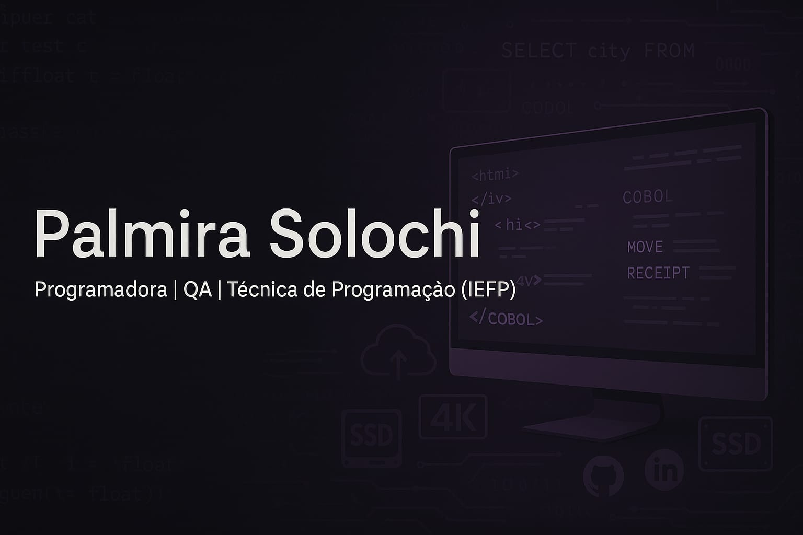

<p align="center">
  
</p>

<h1 align="center">👩‍💻 Palmira Solochi</h1>

<p align="center"><strong>QA Profissional | Programadora em Formação (COBOL, Mainframe, Backend Java)</strong><br>
📍 Portugal 🇵🇹 | 💬 Inglês Intermédio | 🇫🇷 Francês Técnico Básico</p>

<p align="center">
  
  
  
</p>

---

> ✨ *“Qualidade, segurança e legado: a minha base como QA e futura programadora Mainframe.”*

Sou apaixonada por tecnologia e atualmente estou em transição de carreira da área do Direito para Tecnologia da Informação,onde encontrei a combinação perfeita entre lógica,estrutura e resolução de problemas.

Com uma sólida experiência anterior em contextos jurídicos e administrativos, desenvolvi competências como análise minuciosa ao detalhe e comunicação clara, qualidades que hoje aplico em Quality Assurance(QA) e programação.

 Tenho formação concluída em **Quality Assurance (QA)**, atualmente aprofundo os meus conhecimentos em **COBOL,Mainframe e Backend Java** para atuar em ambientes corporativos exigentes.

💼 Experiência com testes manuais e automatizados (Selenium, Cypress, Cucumber, BDD).  
🧠 Perfil tradicional, focada em boas práticas, clareza no código e disciplina de trabalho.

---

## 🌱 Em aprendizagem

- 📀 **COBOL, JCL, TSO/ISPF e Zowe CLI**
- 🧰 **SQL e Administração de Bases de Dados**
- ☕ **Java e ASP.NET Core MVC para aplicações Web**
- 🔐 **Segurança no Desenvolvimento de Software**
- 🌍 **Francês técnico básico**
- 🇬🇧 **Inglês intermédio (técnico e conversacional)**

---

## 🛠️ Tecnologias e Ferramentas

```txt
COBOL • JCL • SQL • TSO/ISPF • Visual Studio Code • Git • GitHub • IntelliJ • Eclipse 
ASP.NET • Java • Zowe CLI • Postman • Selenium • OWASP ZAP • Jira • Xray 
Cypress • JavaScript • Capybara • Gherkin • Cucumber • BDD
```

---

## 📌 Projetos em destaque

| Projeto | Descrição | Tecnologias |
|--------|-----------|-------------|
| 💼 **Sistema de Gestão de Contas (Mainframe)** | Backend bancário simulado | COBOL, JCL, DB2 |
| 🌐 **WebApp de Consulta de Clientes** | Interface com base de dados | ASP.NET, SQL |
| 🧪 **Testes de Segurança em APIs** | Validação e hardening | Postman, OWASP ZAP |
| ✅ **Testes Automatizados** | Projeto completo com BDD | Selenium, Cypress, JavaScript |

*📂 Repositórios disponíveis em breve. Estou a organizar os códigos conforme a boa prática para apresentação.*

---

## 📫 Contacto

- 📧 (mailto:psolochi2016@gmail.com.com)
- 🔗 [LinkedIn](https://www.linkedin.com/in/palmira-solochi-79a1a3317/)
---

## ✨ Curiosidades

- ✔️ Valorizo a **ética no trabalho** e o **respeito à hierarquia**.
- 📚 Aprendizagem contínua faz parte do meu dia a dia.
- 🌍 Foco em atuar em **ambientes financeiros exigentes** e projetos internacionais.
- 🛡️ Experiência em QA fortaleceu minha **visão crítica e foco na prevenção de falhas**.

---

<p align="center"><em>“Tecnologia com responsabilidade e propósito.”</em></p>
 
